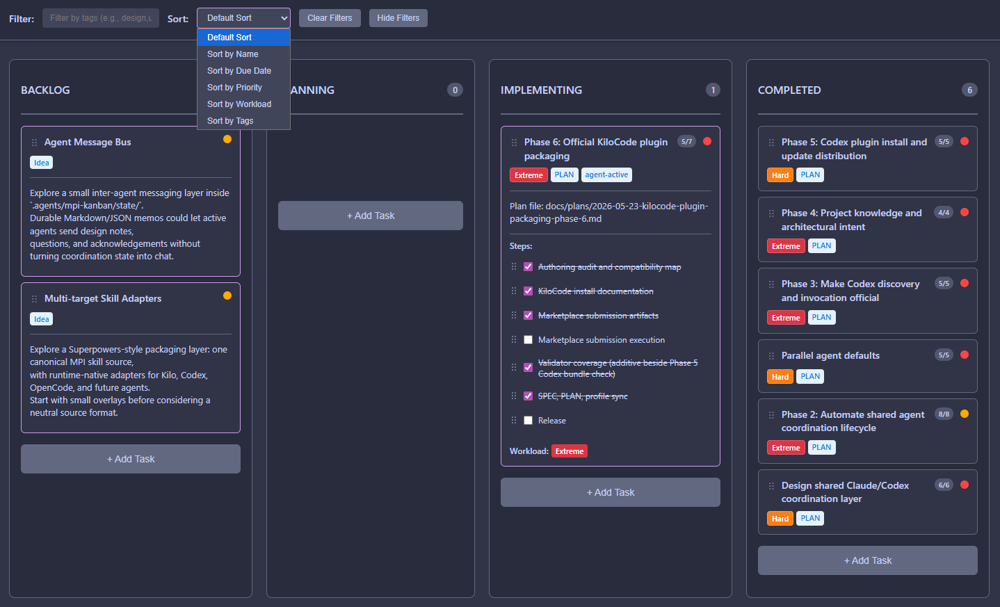

# Mpi-Kanban

Mpi-Kanban is a VS Code extension that supports the
[Mpi-Kanban Agent Skills pack](https://github.com/MadPonyInteractive/mpi-kanban).
It is not a standalone Kanban plugin; it gives you a readable, editor-native
view of the task board that the skills create and maintain.

The skills own agent workflow state. This extension owns the VS Code experience
for `.agents/mpi-kanban/board.json` and the linked
`.agents/mpi-kanban/tasks/<id>/` workspaces, rendering that JSON contract as an
interactive board beside Claude Code, Codex, or another agent panel.



## Features

- **MPI board contract**: opens `.agents/mpi-kanban/board.json` in the selected
  workspace root.
- **Task board view**: displays fixed `To do`, `Doing`, and `Done` columns.
- **Live reload**: watches `board.json` and task-card JSON files.
- **Drag and drop**: moves whole cards between columns and appends task events.
- **Task details**: shows visible `MPI-*` IDs, short descriptions, attention,
  checklist previews for active work, and task workspace links.
- **VS Code themed UI**: follows the active editor theme and can be kept open
  beside Claude Code, Codex, or another agent panel.

## Quick Start

### Install

Install from the VS Code Marketplace:

```text
MadPonyInteractive.mpi-kanban
```

### Open The Board

1. Open a workspace that contains `.agents/mpi-kanban/board.json`.
2. Run **Mpi-Kanban: Open Mpi-Kanban Board** from the Command Palette.
3. Leave the board open while the agent workflow edits JSON task files.

The board file is normally created by the Mpi-Kanban Agent Skills pack when you
start or continue MPI workflow work. Use
`npx skills add MadPonyInteractive/mpi-kanban --all -y -g` to install or update
the complete pack.

### Multi-Root Workspaces

In a multi-root `.code-workspace`, Mpi-Kanban uses one active Kanban root. When
exactly one workspace folder contains `.agents/mpi-kanban/board.json`, that
folder opens automatically. When multiple folders contain a board, the extension
prompts you to select the active root and persists it in the workspace setting
`mpi-kanban.kanbanRoot`.

The setting accepts a workspace folder URI, filesystem path, or folder name.
Changing `mpi-kanban.kanbanRoot` reloads an open board panel, and file watchers
track the selected root even when it is not the first folder in the workspace.

If no JSON board exists but the workspace contains MPI folders or legacy
`kanban.md` files, Mpi-Kanban offers setup actions to install or update the
skills pack, or to select a legacy root for migration when one is available.

### Legacy Markdown Boards

If a workspace has `.agents/mpi-kanban/kanban.md` or
`.claude/mpi-kanban/kanban.md` but no JSON board, opening Mpi-Kanban shows a
migration prompt. Approving it creates:

- `.agents/mpi-kanban/board.json`
- `.agents/mpi-kanban/events.jsonl`
- `.agents/mpi-kanban/tasks/MPI-*/` task workspaces
- `.agents/mpi-kanban/legacy/kanban-<timestamp>.md`

The extension does not modify or delete the source `kanban.md` during this
migration. After `board.json` exists, the JSON board is the live source.

## Board Contract

The extension is intentionally focused on the MPI JSON task board:

```text
.agents/mpi-kanban/board.json
.agents/mpi-kanban/events.jsonl
.agents/mpi-kanban/tasks/<id>/task.json
```

The board has exactly three fixed columns: `todo`, `doing`, and `done`.
User-facing labels are `To do`, `Doing`, and `Done`. Task IDs are visible
system-assigned IDs such as `MPI-42`.

Legacy `.agents/mpi-kanban/kanban.md` files are migration inputs or snapshots,
not the live source once `board.json` exists.

## Example Board

```json
{
  "schema": "mpi-kanban/board/v1",
  "next_id": 4,
  "columns": {
    "todo": ["MPI-1"],
    "doing": ["MPI-2"],
    "done": ["MPI-3"]
  }
}
```

## Development

```bash
npm install
npm run compile
```

Create a local VSIX package:

```bash
npm exec -- vsce package
```

## Publishing

See [PUBLISHING.md](./PUBLISHING.md) for Marketplace account setup, manual
Marketplace updates, and the GitHub Release process.

## Attribution

This extension is a fork of
[Markdown Kanban](https://github.com/holooooo/markdown-kanban) by holooooo.
The upstream project is licensed under MIT. The original copyright notice is
preserved in [LICENSE](./LICENSE), and fork-specific attribution is recorded in
[NOTICE](./NOTICE).

## License

MIT.

